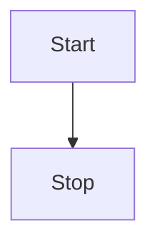

  

  

Innhold

[Innledning. 7](#_Toc482709133)

[Om klubben. 7](#_Toc482709134)

[Klubbens historie. 8](#_Toc482709135)

[Verdier  9](#_Toc482709136)

[Visjon. 9](#_Toc482709137)

[Virksomhetsidé. 9](#_Toc482709138)

[Hovedmål  9](#_Toc482709139)

[Organisering. 11](#_Toc482709140)

[Roller og ansvar  12](#_Toc482709141)

[Årsmøtet  12](#_Toc482709142)

[Styret  12](#_Toc482709143)

[Styrets arbeid. 15](#_Toc482709144)

[Utvalg/komiteer  16](#_Toc482709145)

[Hovedtrener konkurranse. 17](#_Toc482709146)

[Arbeidsoppgaver  17](#_Toc482709147)

[Hovedtrener svømmeskole/Svømmeskoleansvarlig. 19](#_Toc482709148)

[Arbeidsoppgaver  19](#_Toc482709149)

[Ansvar ved reisestevner  20](#_Toc482709150)

[Ansvar ved treningsleir  20](#_Toc482709151)

[Ansatte instruktører / trenere. 22](#_Toc482709152)

[Kontrakter  22](#_Toc482709153)

[Politiattester  22](#_Toc482709154)

[Informasjon om lønn. 22](#_Toc482709155)

[Kurs. 22](#_Toc482709156)

[Fravær / sykdom.. 23](#_Toc482709157)

[Reiser / Stevner  23](#_Toc482709158)

[Arbeidsavtalens opphør  23](#_Toc482709159)

[Retningslinjer  25](#_Toc482709160)

[Retningslinjer utøvere. 26](#_Toc482709161)

[Retningslinjer foreldre/foresatte. 27](#_Toc482709162)

[Retningslinjer mobbing. 28](#_Toc482709163)

[Retningslinjer trenere. 29](#_Toc482709164)

[Retningslinjer alkohol  30](#_Toc482709165)

[Retningslinjer skikk og bruk e-post  31](#_Toc482709166)

[Retningslinjer reiseleder  32](#_Toc482709167)

[Retningslinjer utdanningsansvarlig. 34](#_Toc482709168)

[Retningslinjer valgkomite. 35](#_Toc482709169)

[Klubbens nå situasjon. 40](#_Toc482709170)

[Medlemsoversikt  40](#_Toc482709171)

[Medlemmer  40](#_Toc482709172)

[Aldersfordeling. 40](#_Toc482709173)

[Styrke og Svakhets analyse. 40](#_Toc482709174)

[Svømmeskolen. 40](#_Toc482709175)

[Bredde aktiviteter  40](#_Toc482709176)

[Konkurransegruppene. 40](#_Toc482709177)

[Sportslig nivå. 40](#_Toc482709178)

[Aktiviteter  41](#_Toc482709179)

[Trenere. 41](#_Toc482709180)

[Kompetanse nivå trenere. 41](#_Toc482709181)

[Anlegg Fasiliteter  41](#_Toc482709182)

[Basseng. 41](#_Toc482709183)

[Landtrening. 41](#_Toc482709184)

[Klubblokaler  41](#_Toc482709185)

[Utstyr  41](#_Toc482709186)

[Organisering av kurs og basseng. 43](#_Toc482709187)

[Antall barn pr. instruktør  43](#_Toc482709188)

[Barneidrett  43](#_Toc482709189)

[Roller og ansvar i svømmeskolen. 44](#_Toc482709190)

[Kursleder/programansvarlig/kurslederassistent  44](#_Toc482709191)

[Instruktør/hjelpeinstruktør/lærling. 44](#_Toc482709192)

[Svømmeskole plan. 45](#_Toc482709193)

[Mål  45](#_Toc482709194)

[Kortsiktige mål (2015)  45](#_Toc482709195)

[Mellomlangsiktige mål (2016/2017)  45](#_Toc482709196)

[Langsiktige mål (2017->)  45](#_Toc482709197)

[Treningsgruppe A og B. 47](#_Toc482709198)

[Hensikt  47](#_Toc482709199)

[Treningsgruppe A. 47](#_Toc482709200)

[Treningsgruppe B. 47](#_Toc482709201)

[Treningstilbud. 47](#_Toc482709202)

[Masters  47](#_Toc482709203)

[Hensikt  47](#_Toc482709204)

[Bredde aktivitet plan. 48](#_Toc482709205)

[Mål  48](#_Toc482709206)

[Kortsiktige mål (2015)  48](#_Toc482709207)

[Mellomlangsiktige mål (2016/2017)  48](#_Toc482709208)

[Langsiktige mål (2017->)  48](#_Toc482709209)

[Organisering, roller og ansvar  50](#_Toc482709210)

[Konkurransegruppe B. 50](#_Toc482709211)

[Hensikt  50](#_Toc482709212)

[Sportslig målsetning. 50](#_Toc482709213)

[Fokus i gruppen. 50](#_Toc482709214)

[Forventninger til utøvere. 50](#_Toc482709215)

[Konkurransegruppe A. 50](#_Toc482709216)

[Hensikt  50](#_Toc482709217)

[Sportslig målsetning. 50](#_Toc482709218)

[Fokus i gruppen. 50](#_Toc482709219)

[Forventninger til utøvere. 50](#_Toc482709220)

[Elitegruppe B. 51](#_Toc482709221)

[Hensikt  51](#_Toc482709222)

[Sportslig målsetning for Elitegruppe B. 51](#_Toc482709223)

[Fokus i gruppen. 51](#_Toc482709224)

[Forventninger til utøvere. 51](#_Toc482709225)

[Elitegruppe A. 51](#_Toc482709226)

[Hensikt  51](#_Toc482709227)

[Sportslig målsetning for Elitegruppe A. 51](#_Toc482709228)

[Fokus i gruppen. 51](#_Toc482709229)

[Forventninger til utøvere. 52](#_Toc482709230)

[Sportslig plan. 53](#_Toc482709231)

[Målsetinger  53](#_Toc482709232)

[Kortsiktige mål (2015/2016)  53](#_Toc482709233)

[Mellomlangsiktige mål (2017/2019)  53](#_Toc482709234)

[Langsiktige mål (2020->)  53](#_Toc482709235)

[Mål antall deltagere på mesterskap. 53](#_Toc482709236)

[Mål landslangsvømmere. 53](#_Toc482709237)

[Forbedrings og oppmøtemål pr. Gruppe. 53](#_Toc482709238)

[Teknikkmål pr gruppe. 53](#_Toc482709239)

[KONSEKVENSER AV MÅLSETTING. 54](#_Toc482709240)

[Økonomi  54](#_Toc482709241)

[STRATEGI (VIRKEMIDLER) OG TILTAK.  54](#_Toc482709242)

[Etterutdanning, kompetanseheving, Internutdanning,  54](#_Toc482709243)

[Utdanning av utøver og foreldre.  54](#_Toc482709244)

[Handlingsplan. 54](#_Toc482709245)

[Treningsinnhold. 55](#_Toc482709246)

[TESTING. 55](#_Toc482709247)

[TRENINGSRAPPORTERING. 55](#_Toc482709248)

[OPPLEGG FOR HVER ENKELT GRUPPE. 55](#_Toc482709249)

[Oppmøtekrav for Elitegrupper og Konkurransegruppe A. 57](#_Toc482709250)

[Oppmøtekrav. 57](#_Toc482709251)

[Grunnlag for oppmøte. 57](#_Toc482709252)

[Fravær  58](#_Toc482709253)

[Oppfølging. 58](#_Toc482709254)

[Treningsleir  59](#_Toc482709255)

[Krav for å delta:  59](#_Toc482709256)

[Påmelding:  59](#_Toc482709257)

[Opphold treningsleir:  59](#_Toc482709258)

[Regler:  59](#_Toc482709259)

[Innsats- og vandrepokaler  60](#_Toc482709260)

[FORBEREDELSER I FORBINDELSE MED STEVNEARRANGEMENT I SSLK. 62](#_Toc482709261)

[Tillegg for julestevnet  63](#_Toc482709262)

[Sandnes Sprinten. 64](#_Toc482709263)

[Klubbstevne. 65](#_Toc482709264)

[Riskakrutten. 66](#_Toc482709265)

[Julestevnet  67](#_Toc482709266)

[Alkohol/rusmidler  69](#_Toc482709267)

[Retningslinjer  69](#_Toc482709268)

[Sanksjoner  69](#_Toc482709269)

[Politiattester  70](#_Toc482709270)

[Informasjonsforvaltning. 71](#_Toc482709271)

[Personopplysninger  71](#_Toc482709272)

[Permisjoner  72](#_Toc482709273)

[Retningslinjer for støtte ved nasjonale mesterskap. 74](#_Toc482709274)

[NM kortbane, NM/Jr langbane, NM Jr/UM.. 74](#_Toc482709275)

[Årsklasse Mønstring (ÅM)  74](#_Toc482709276)

  

  

Sandnes Svømme og Livredningsklubb

  

# Innledning

Klubbhåndboka skal svare på de viktigste spørsmålene om klubben og gjøre det enkelt å finne ut hva som gjelder internt i klubben. Den skal sikre at det er kontinuitet i det som bestemmes og gjøres.

Klubbhåndboka er laget av styret etter innspill fra komiteer, utvalg, trenere, utøvere og foreldre i klubben. Håndboka er et arbeidsverktøy for alle medlemmer, utøvere, foreldre, styret, komiteer, utvalg, ansatte, trenere og dommere i klubben vår.

Håndboka skal benyttes til å forstå og kommunisere hva som er viktig i vår klubb, hvilken klubb vi er, hva vi skal oppnå, hva vi tilbyr, og hvordan vi gjør ting.

## Om klubben

Sandnes Svømme og Livredningsklubb satser for å ha et bredt tilbud av svømmeaktiviteter fra svømmeopplæring til elite idrett. Som medlem av Norges Svømmeskole (Norges Svømmeforbund) har vi etablert en svømmeskole i tråd med den nasjonale plan for svømmeopplæring. Alle klubber som er medlem av Norges Svømmeskole skal drive svømmeopplæring av høy faglig kvalitet etter Norges Svømmeforbunds prinsipper.

Svømmeopplæring foregår i hovedsak på Øygaard og Høyland Ungdomskole, mens konkurranse og trenings partier bruker de større svømmehallene på Giske, Sandvika og Riska.

I en kommune med sterk vekst, står vi foran store utfordringer i forhold til å møte det fremtidige behovet for svømmeopplæring av den voksende andelen barn og unge i Sandnes. Sandnes SLK gir et viktig samfunnsnyttig bidrag både ved å trekke jenter og gutter inn i organisert idrett og spesielt ved generelt å styrke svømme- og livredningsferdighetene i samfunnet! I en by som Sandnes med nærhet til fjord og vann er dette av særlig betydning.

Svømmeklubben ønsker å tilby barn og unge et sosialt fellesskap i klubben, og der ungdommen har et positivt miljø å være i med mulighet for utvikling i tråd med egne ambisjoner. Dette er en viktig faktor for mange av våre svømmere, som blir værende i SSLK i mange år, som aktive svømmere eller instruktører.

Svømmeopplæring krever et stort apparat på alle nivå. Det faktum at vi opererer med trening i vann for barn betyr at klubben må til enhver tid ha godt kvalifiserte og tilstedeværende trenere. Særlig settes det strenge krav til instruktørene som tar seg av de aller yngste barna, både i antall trenere og utdanning.

For de som ønsker å bruke svømming til å holde seg i form har klubben etablert treningsgrupper for ungdom og master svømmere hvor en kan drive med svømming som trening, og konkurrere på regionale stevner dersom dette er ønskelig. Hovedfokus i gruppene er å legge til rette for trivsel i treningssituasjonen slik at alle skal ha glede av svømmingen.

De siste årene har klubben også satset på å legge til rette for de som ønsker å drive med svømming som idrett og tar sikte på å etablere seg som en av landets 10 beste klubber på nasjonalt nivå. Konkurranse trening på dette nivået krever svært mye trening og basseng tid, noe som er utfordrende når kapasiteten på svømmeanlegg i kommunen allerede er sprengt.

## Klubbens historie

Det var lenge et savn at Sandnes ikke hadde en svømmeklubb. Flere krefter var i gang for å starte opp, men først når Norges Livredningsselskap kom inn i bildet ble det en realitet. Ved et konstituerende møte 15. august 1927 ble laget stiftet og formann i Norges Livredningsselskap var tilstede. Det første styret bestod av: Sverre Asserson (formann), videre Th. Hovstad, O.O. Berge, Jørgen Rostrup og Alf Skjæveland.

Som de fleste eldre Sandnesbuer vet, ble tilholdsstedet for aktivitetene i klubben de første årene flyttet noe på, men best kjent er nok Sjøbadet på Hana (Rovik) som Sjøspeiderne overtok da Giskehallen stod ferdig i 1965. Ved Sjøbadet var det ikke alltid så greit å trene. Sesongen var kort, 4-5 måneder, og når en skulle trene i ned til 12-13 grader i vannet kunne det ikke alltid være morsomt. Klubben drev på med litt stup også i denne tiden, både tårn (10m) og sviktstup.

Som en historisk kuriositet kan nevnes at svømmeklubben var den som sammen med Frisinn sportsklubb i Stavanger faktisk startet opp volleyballsporten i Norge.

Gjennom alle år har klubben drevet en svært aktiv svømmeopplæring i byen. Livredningskurser er det og blitt avholdt mange av. Magne Lura og Paul Lura var de bærende krefter i gjennom mer enn 30 år. Det er ikke få tusen ”sandnesgauker” de har lært å svømme.

  

## Verdier

Sandnes Svømme og Livredningsklubb baserer sin aktivitet på felles vedtatte aktivitetsverdier for norsk idrett:

**Idrettsglede, fellesskap, helse og ærlighet**

Klubben vår drives etter idrettens organisasjonsverdier:

**Frivillighet, demokrati, lojalitet og likeverd**

Ut fra fellesverdiene i norsk idrett, har Sandnes Svømme og Livredningsklubb tydeliggjort hva som skal prege oss og klubben vår. Verdiene beskriver hvordan vi er og hvordan vi vil bli.

Sandnes Svømme og Livredningsklubb sine verdier:

**Inkluderende, omtenksom og rettferdig**

Verdiene skal hjelpe oss til

•  å skape et godt klubbmiljø, der vi tar godt vare på hverandre

•  å skape gode holdninger, som fører til et godt treningsklima

•  å være en klubb som er kjent for godt samarbeid og god oppførsel

•  å fremstå slik klubben ønsker i alle sammenhenger

•  å bli tydelige, få frem det som skiller oss fra andre, og klargjøre vår spesielle identitet

## Visjon

Sandnes Svømme og Livredningsklubb sin visjon bygger på Norges Svømmeforbunds visjon om at svømming skal være den mest fremgangsrike idretten i Norge, gjennom å gjøre:

Svømming, den mest fremgangsrike idretten i Sandnes

## Virksomhetsidé

Sandnes Svømme og Livredningsklubb sin virksomhetsidé:

Gi alle i Sandnes en mulighet til å lære livsviktig kunnskap ved å bli svømme dyktige, samt å gi en mulighet til å oppleve gleden av svømmingen som idrett eller livslang trening

## Hovedmål

Hovedmålet til Sandnes Svømme og Livredningsklubb:

* Være best på svømmeopplæring i Sandnes

* Være en av Norges ledende klubber innenfor konkurranse svømming

  

  

Organisering, roller og ansvar

  

# Organisering

## Roller og ansvar

### Årsmøtet

Årsmøtet er klubbens høyeste myndighet og avholdes hvert år innen utgangen av mars måned. Årsmøtets oppgaver er nærmere beskrevet i klubbens lov. Der fremgår det også hvordan årsmøtet skal innkalles.

For å ha stemmerett og være valgbar må et medlem ha fylt 15 år, vært medlem i klubben i minst én måned og ha betalt kontingent.

Innkalling til årsmøtet annonseres på klubbens hjemmeside.

Årsmøtet legger grunnlaget for klubbens virksomhet og styrets arbeid. Alle som ønsker å være med på å bestemme hva klubben skal gjøre, og hvordan den skal drives, bør delta på årsmøtet. Protokollen fra årsmøtet bør legges ut på klubbens hjemmeside.

### Styret

Styret er klubbens høyeste myndighet mellom årsmøtene. Noen saker kan ikke styrebehandles, men må behandles av årsmøtet. Det gjelder saker som fremgår av «Årsmøtets oppgaver», og saker som er av ekstraordinær karakter eller av betydelig omfang i forhold til klubbens størrelse og virksomhet. Dersom styret er i tvil, bør saken opp på årsmøtet.

Lovpålagte oppgaver for styret:

* Sette i verk årsmøtets og overordnede organisasjonsledds regelverk og vedtak

* Påse at idrettslagets midler brukes og forvaltes på en forsvarlig måte, i samsvar med de vedtakene som er fattet på årsmøtet eller i et overordnet organisasjonsledd, og sørge for at idrettslaget har en tilfredsstillende organisering av regnskaps- og budsjettfunksjonen og en forsvarlig økonomistyring

* Etter behov oppnevne komiteer, utvalg eller personer for spesielle oppgaver og utarbeide mandat/instruks for deres funksjon

* Representere idrettslaget utad

* Oppnevne en som er ansvarlig for politiattester

Andre viktige oppgaver:

* Planlegge og ivareta lagets totale drift, herunder mål- og strategiarbeid, budsjett og regnskap

* Påse at idrettens retningslinjer for aktiviteten i idrettslaget blir fulgt

* Stå for idrettslagets daglige ledelse

* Arbeidsgiveransvar for eventuelle ansatte

* Legge frem innstilling til årsmøtet på kandidater til valgkomité

* Oppnevne to personer som i fellesskap skal disponere idrettslagets konti, og sørge for at de er dekket av underslagsforsikring

* Oppnevne eller engasjere regnskapsfører

* Lage årsberetning fra styret til årsmøtet

* Oppdatering av klubbhåndboka

Styremedlemmene kan velges til spesifikke oppgaver som kasserer eller sekretær på årsmøtet, eller styret kan selv fordele oppgavene.

#### Leder

• Er klubbens ansikt utad, og klubbens representant i møter og forhandlinger

• Står for klubbens daglige ledelse, koordinerer styrets og klubbens totale aktivitet

• Innkaller til styremøter, forbereder saker og leder møtene

• Anviser utbetalinger sammen med kasserer

• Skal påse at valg, adresseforandringer, oppgaver over medlemmer o.a. som har interesse for/skal sendes inn til krets- og forbund, meldes til overordnede instanser innen gitte frister. Brønnøysund – registrering.

• Lede og samordne styrets arbeid innen rammen av klubbens vedtekter

• Inneha klubbens arbeidsgiveransvar

• Være igangsetter for strategiarbeid (årlige handlingsplaner og klubbens virksomhetsplan)

• Sammen med klubbens økonomiansvarlige ha løpende oppfølging av klubbens økonomi

• Delegere oppgaver og ansvar i samråd med styret

• Presseansvarlig

• Informere krets, forbund og naboklubber om styresammensetning

#### Nestleder

• Avlaste og være stedfortreder for leder

• Være klubbens ansvarlige for barneidretten

• Være klubbens dommerkontakt

• Holde oversikt over forsikringer

• Fremme andre inntektsbringende tiltak

• Holde styret informert om tilskuddsordninger og utarbeide søknader om slik støtte

• Utarbeide kontrakter til instruktører/trenere, innhente politiattester

• Påse at instruktørene/trenerne og andre verv har nødvendig utdanning og autorisasjon

• Melde på kursdeltakere til kursarrangement og oppdatere personallisten

• Søke NSF om refusjon av kursutgifter

• Holde personalmappene oppdatert

• Andre forefallende oppgaver etter behov

• Myndighet i.h.t. delegasjonsfullmakter for vervet

#### Kasserer

• Føre kontroll med klubbens økonomi og holde styret jevnlig orientert

• Forestå inn- og utbetalinger, samt forskuddstrekk og arbeidsgiveravgift i rettmessig tid

• Beregning og utbetaling av lønn

• Påse at budsjettet blir fulgt opp

• Kontaktperson mot regnskapsfører og påse at denne får alle bilag for føring til rett tid

• Vurdering og fremme forslag til endringer av medlemskontingent

• Utarbeide forslag til budsjett

• Føre kontroll med bankbeholdning og sikre at kontoportefølje til enhver tid er optimalisert

• Utarbeide oversikt over økonomi i klubben kvartalsvis

• Ansvarlig for ”Cash Management” på egne stevner

• Andre forefallende oppgaver etter behov

• Myndighet i.h.t. delegasjonsfullmakter for vervet

#### Sekretær

• Skrive og distribuere referat fra styremøter og årsmøte

• Utarbeide utkast til årsmelding

• Samle og kopiere nødvendig antall årsmøtepapirer

• Holde klubbens arkiv

• Bistå klubben i utarbeidelse av innbydelser og skriftlig materiale

• Holde oversikt over dommeroversikt

• Oppdatere årshjul

• Andre forefallende oppgaver etter behov

• Ansvar for å lese og administrere klubbmail

• Myndighet i.h.t. delegasjonsfullmakter for vervet

#### Oppmann

• Avholde trenermøter

• Legge frem saker fra trenere og utøvere på styremøter

• Holde styret informert om idrettslig aktivitet og reglement

• Utarbeide forslag til stevner for styret i samarbeid med trener

• Utarbeide stevneprogram for SSLK stevner i samarbeid med trener/styret

• Være ansvarlig for sekretariatet på egne stevner

• Sette opp stevnedeltakelse for de enkelte svømmere i samarbeid med trener

• Melde svømmere på til aktuelle stevner

• Bekjentgjøre resultat fra stevner til pressen, når dette er aktuelt

• Ansvarlig for lisensregistrering i NSF’s system.

• Informere kasserer i god tid med hensyn til stevnedeltakelse og startavgifter

• Ansvarlig for utmerkelser (vandre-/innsatspokaler o.l)

• Andre forefallende oppgaver etter behov

• Tidtakings-sjef på egne stevner/arrangement

• Søknader om leie av hall og kafésalg

• Myndighet i.h.t. delegasjonsfullmakter for vervet

#### Materialforvalter

• Holde oversikt over utstyrssituasjonen

• Vedlikeholde utstyr og klubbrom

• Forestå innkjøp av utstyr, premier og pokaler

• Informere kasserer i god tid om innkjøp og salg av klubbutstyr og klubbeffekter

• Følge opp evt. betalingsforpliktelser til klubben fra utøverne (vedr. klubbutstyr)

• Skaffe til veie nødvendig utstyr og premier for egne arrangementer / stevner

• Ha en opptelling av varelager til årsmøte

• Andre forefallende oppgaver etter behov.

• Myndighet til innkjøp av utstyr som er behovsmeldt til, og godkjent av styret gjennom vedtak eller budsjett. Mindre innkjøp for å sikre den daglige driften avklares med kasserer.

#### Medlemsansvarlig

• Forestå fakturering/innbetalinger av kontingenter

• Føre medlemslister og holde disse à jour

• Oppdatere tryggivann.no

• Sende ut faktura på kontingenter til medlemmene ved sesongoppstart, samt egenandeler ved reiser

• Kreve inn medlemskontingentene og andre fordringer og rapportere status på disse på månedlig basis til kasserer

• Andre forefallende oppgaver etter behov

• Myndighet i.h.t. delegasjonsfullmakter for vervet

#### Reiseansvarlig

• Foreslå og innhente tilbud på treningsleirer i samarbeid med trenere og legge dette frem for styret

• Være ansvarlig for reisestevner/treningsleirer

• Bestille hotell/reiser og sende ut informasjon til de reisende

• Informere medlemsansvarlig hvem som deltar og hvilken pris som skal faktureres

• Oppdatere deltagerliste i samarbeid med medlemsansvarlig

• Informere kasserer i god tid om evt. reise- og/eller deltakeravgifter

• Andre forefallende oppgaver etter behov

• Holde oversikt over sponsoravtaler

• Myndighet i.h.t. delegasjonsfullmakter for vervet

#### Foreldrelaget

• Organisering og fordeling av dugnadsarbeid blant medlemmenes foreldre

• Lede foreldrelaget og være lagets bindeledd mot styret

• Ha oversikt over aktiviteten i klubben og i foreldrelaget

• Holde styret informert om arbeidet i laget og fremme forslag om nye aktiviteter

• Organisere og gjennomføre dugnadsarbeid ved sosiale aktiviteter (inkl. kafedrift)

• Skaffe tidtakere til egne stevner, pålagte eksterne stevner, samt forestå salg og servering ved stevnene

• Andre forefallende oppgaver etter behov

• Myndighet i.h.t. delegasjonsfullmakter for vervet

• Holde kontakt med foreldreutvalget

#### Svømmernes representant

• Holde seg informert om driften i SSLK

• Melde fra til styret om saker fra utøvende medlemmer

• Representere SSLK i saker for ungdomskontakter i krets og forbund

• Andre forefallende oppgaver etter behov

• Myndighet: På vegne av utøvende medlemmer har ungdomskontakten innsynsrett i driften av SSLK, og har rett til å bli informert om relevante vedtak i styret som gjelder medlemmene.

• Ungdomskontakten (svømmernes representant) har rett til å delta på styremøter for å tale utøvende medlemmers sak, og skal innkalles til styremøter som skal behandle saker som endrer, eller griper direkte inn i de utøvende medlemmers situasjon i klubben.

### Styrets arbeid

Styret møtes normalt månedlig for styremøter i Radlastova på Sandnes stadion. Saker til behandling meldes leder i god tid slik at sakene kan bli forberedt før styremøtet. Hovedtrenere har møterett og vil normalt være med i begynnelsen av møtet dersom de har saker som de ønsker fremmet for styret.

Styret er vedtaksført når et flertall av styrets medlemmer er til stede. Vedtak fattes med flertall av de avgitte stemmene. Ved stemmelikhet er møtelederens stemme avgjørende. Styremedlemmene plikter å respektere et styrevedtak, selv om det er fattet mot vedkommendes egen stemme.

Styremøter kan avholdes per e‑post eller per telefon, se lovnorm § 10. Det skal alltid føres protokoll fra styremøtene.

Hvert styremøte bør innledningsvis starte med spørsmål om det foreligger mulig inhabilitet i noen av sakene, og behandlingen av inhabilitet skal alltid protokolleres. Om inhabilitet, se lovnorm § 9.

### Utvalg/komiteer

Mandat og oppgaver for utvalg/komiteer som er lovpålagte, går frem av klubbens lov. Det gjelder valgkomité og valgt revisor (ev. kontrollkomité der det er et krav).

Aktuelle styreoppnevnte funksjoner/utvalg:

* Sportslig utvalg

* Sponsor gruppe

* Idrettslinje

* Foreldre lag

* Anlegg

* IT gruppe

  

## Hovedtrener konkurranse

Hovedtrener er ansvarlig for klubbens sportslige aktivitetstilbud. Hovedtrener har det faglige ansvaret for klubbens øvrige trenerteam som består av mange dyktige og erfarne trenere. Hovedtrener har instruksjonsmyndighet overfor klubbens øvrige gruppetrenere. Hovedtreneren skal ha god kjennskap til norsk svømmesport. Hovedtrener rapporterer til styret i klubben.

Kvalifikasjoner og personlige egenskaper

• Brennende engasjement for å utvikle barn og ungdom innen svømming.

• God svømmefaglig kompetanse både teoretisk og praktisk

• Evne og lyst til å lede andre trenere i et trenerteam

• Selvstendig og ryddig med gode samarbeidsevner

• Positiv og løsningsorientert

• Gode administrative egenskaper

• Opptatt av å utvikle klubben som en helhet

• Evne til å skape disiplin, gode holdninger og oppnå resultater.

• Gode kommunikasjonsevner som skaper glede, mestring og motivasjon.

• Ambisiøs og ønsker å oppnå resultater på et høyt nivå, samtidig som en tar hensyn til behovene for å utvikle hver svømmer individuelt.

### Arbeidsoppgaver

#### Sportslig ansvar:

• Lede den sportslige utviklingen i klubben, slik at klubbens mål nås.

• Hovedansvar for det faglige innholdet i klubbens utviklingstrapp. Sørge for at det er en ”rød tråd” gjennom hele klubbens aktivitetstilbud.

• Ivareta rekruttering og en sportslig utvikling i klubben, gruppevis og individuelt.

• Trene, lede og inspirere utøverne til å delta i daglig trening og i lokale, nasjonale og internasjonale konkurranser.

• Planlegge, tilrettelegge, gjennomføre og følge opp trening av utøvere i ulike aldre med ulike mål (kommentar: hovedtrener kan ha ansvar for 1 gruppe, eventuelt oppfølgingsansvar overfor flere grupper med egne trenere). Dette gjelder landtrening så vel som svømmetrening.

• Delta som trener på stevner og treningssamlinger etter styrets retningslinjer.

• Delta i planlegging og arrangering av stevner, leire og arrangementer i regi av klubben.

• Delta og eventuelt rapportere på styremøtene

• Tett samarbeid med Svømmeskoleansvarlig

• Avholde trenermøter (månedlig, ukentlig, kvartalsvis?)

Kommunikasjon:

• Være klubbens hovedkontakt til svømmerne og deres foresatte

• Ha en åpen og god dialog med utøvere og foreldre

• Ansvarlig for sportslig innhold på foreldremøter.

• Være hovedkontakt, sammen med sportslig leder, mellom styret som arbeidsgiver og instruktører og trenere.

• I samarbeid med styret og leder for svømmeskolen - videre utvikle og bruke nettsidene som en effektiv informasjonskanal.

• Ha god kommunikasjon med alle involverte i klubben.

Lederansvar:

• Være overordnet for klubbens trenere og sørge for god informasjon og samarbeid med disse.

• Lede trenermøter.

• Delta i koordinering av sportsåret for utøverne.

Kompetanse:

• Ivareta og koordinere videreutvikling, kursing og opplæring av trenere (eventuelt i samarbeid med klubbens utdanningskontakt).

• Være villig til å være med på kurs og etterutdanning.

• Delta på forumer i regi av NSF, som f.eks Trener/Lederkonferansen

#### Sportslig samarbeid:

• Samarbeide med andre klubber om treningsfaglige forhold og utvikling, både svømmeklubber og andre idrettsmiljøer.

• Samarbeide med andre klubber om treningsleirer og stevner

  

## Hovedtrener svømmeskole/Svømmeskoleansvarlig

Svømmeskoleansvarlig er ansvarlig for oppfølging av ansatte i svømmeskolen, og må sørge for at de får den nødvendige utdanningen og blir fulgt opp med videre skolering. Den videre skoleringen kan skje internt i klubben, eller gjennom tilrettelagte seminarer som NSF står for. Den svømmeskoleansvarlige har også ansvar for informasjon til deltagere og foresatte.

Svømmeopplæring omfatter barn, ungdom, voksne, funksjonshemmede, mennesker med flerkulturell bakgrunn og andre grupper som har behov for tilrettelegging.

Ansvaret for svømmeskoleansvarlig innebærer;

• Faglig ansvarlig for svømmeskolen, og sikre at svømmeskolen gjennomføres i tråd med den nasjonale planen for svømmeopplæring.

• Se til at klubben følger opp forpliktelsene i Norges Svømmeskoleavtalen

• Sikre kvalitet i kursene gjennom instruktørutdanning, instruktørsamlinger, informasjon til medlemmer og til styret, riktig dimensjonering av kurstilbudet, svømmefagligkvalitet på kursene, innhold i kursene mm

### Arbeidsoppgaver

• Sette opp kurs

• Kvalitetssikre klubbens kurstilbud

• Oppfølging av www.tryggivann.no

• Sørge for at instruktører har eller får tilbud om utdanning

• Sørge for at alle instruktører har arbeidskontrakt

• Kompetansesamlinger for klubbens instruktører (minst årlig)

• Legge til rette for at instruktører deltar på lokale og regionale kurs- og kompetansehevingsarenaer

• Sørge for at klubbens svømmeskole håndbok og websider om svømmeopplæring/svømmeskole er oppdatert

• Markedsføre nye kurs

• Gjennomføre kvalitetssjekken

• Vurdere nye aktiviteter/kurs

  

## Ansvar ved reisestevner

Reiseansvarlig i styret har ansvar for alt det utenomsportslige ved reisestevner. Dette er praktiske gjøremål som bestilling av overnatting, organisering av transport, økonomi og diverse innkjøp. Det er naturlig å trekke inn foreldre til hjelp med denne oppgaven.

* I god tid før stevnet bør foreldre kontaktes med informasjon om at de trengs som sjåfører og reiseledere. Dette bør gå på rundgang og reiseansvarlig fører lister over hvilke foreldre som er med på hvilke turer.

* Avholde infomøte ca to uker før turen, hvor alle de foreldrene som skal være med får informasjon om turen og hva deres rolle på turen er. En person får oppgaven som reiseleder. Dette må være på plass til møtet: Avreisetidspunkt og retur, samt navneliste over de som skal være med

* Lage et infoskriv om hva som må kjøpes inn på slike turer. Det gjør alt enklere for dem som er ansvarlig for innkjøp av mat.

* En får ansvar for en aktivitet om kvelden, for eksempel ta med seg projektor til å vise film på, quiz osv.

* Sende ut informasjon om stevnet og oppholdet til hele foreldregruppen en uke før, med klar beskjed hvilke foreldre som er ansvarlig på turen

## Ansvar ved treningsleir

Reiseansvarlig i styret har ansvar for alt det utenomsportslige ved treningsleirer. Dette er praktiske gjøremål som bestilling av overnatting, organisering av transport, mat, og treningsfasiliteter. Det er vanlig å bruke et reiseselskap til organiseringen av en oppstarttreningsleir.

* Etter endt treningsleir, vil styret på høsten ta en evaluering og bestemme neste oppstartleir

* Reserver plass allerede på høsten. Estimert antall: 45 stk for begge gruppene

* På begynnelsen av året har en fått bekreftelse, pris, signert kontrakt fra reiseselskapet og betalt depositum

* Reiseansvarlig sjekker pris på evt. transport utenom pakketuren

* Egenandel må utarbeides på grunnlag av: Stk pris på leiren, evt. mat som kommer i tillegg (ferje o.l.), evt. transport utenom, samt beregning av reiseledere. 70 % av totalbeløpet blir årets egenandel (egenandelprosenten bestemmes av årsmøtet)

* Informasjon og påmelding blir sendt ut i februar/mars. Informasjonsskriv sendes via mail og påmelding m/betaling blir sendt via tryggivann. Det er bindende påmelding

* Ansvarlig for medlemsregisteret vil følge opp betalingene. Rapport vil sendes til reiseansvarlig som har oversikten over deltagerne

* Send ut en påmeldingsoversikt til alle foreldrene i gruppen for å kvalitetssikre at alle som ønsker plass, har meldt seg på.

* Lag lugar-/romfordeling sammen med trener.

* Deltagerlisten fylles ut med navn/fødselsår/lugarfordeling og sendes reiseselskapet i begynnelsen av juni.

* Reiseansvarlig sender ut detaljert informasjonsskriv til deltagerne og trenere/reiseledere

* Mappen til ansvarlig reiseleder (for hver gruppe) fylles opp med båtbilletter og evt. matkuponger, bussbekreftelser T/R, timeplan trening/mat, romfordeling og adresseliste til alle deltagerne.

  

  

## Ansatte instruktører / trenere

### Kontrakter

Alle instruktører/trenere i Sandnes Svømme og Livredningsklubb vil motta en kontrakt om midlertidig ansettelse/engasjement ved oppstart.

Stillingsbenevnelsen vil være som følger:

Hjelpeinstruktør  -  Under 16 år med/uten trenerkurs

Instruktør  -  Over 16 år m/trenerkurs

Hjelpetrener  -  Over 18 år med min. trenerkurs 1, noe ansvar

Trener  -  Over 18 år med min. trenerkurs 1 og 2, hovedansvar

### Politiattester

Før en instruktør/trener over 15 år blir ansatt, må det fremvises politiattest til nestleder i klubben. Dette er personlig informasjon og vil bli behandlet deretter. Ved anmerkning på politiattesten er ikke ansettelse aktuelt.

### Informasjon om lønn

-   Timeføring: For timeansatte skal timene telles med halve og hele timer. Eks: Fra 45 min til 1 time og 10 min telles som en time. 1 time og 15 min til 1time og 40 min telles som 1,5 time osv.
-   Timeliste: Alle nyansatte vil få tilsendt en elektronisk timeliste fra arbeidsgiver. I tillegg til timene skal det alltid føres på navn, adresse, telefonnummer, bankkontonummer, lønnssats og skatteprosent/tabell. Husk signatur. Skattekort skal leveres til kasserer i god tid før første lønnsutbetaling. Timelisten skal sendes til arbeidsgiver for godkjenning innen 14. i hver måned. Lønnen vil bli overført til konto den 20. hver måned.
-   Det vil bli beregnet 10,2 % feriepenger av bruttolønn og utbetales i juli året etter.
-   Ingen dekning av km godtgjørelse/buss til og fra jobb
-   Stevnedeltakelse inngår i lønnsbetingelsene.

### Kurs

Som ansatt i svømmeklubben er det enkelte kurs en kan gå gjennom:

-   Livredningskurs: Som nyansatt vil en få et grunnkurs gjennom Livredningsforbundet. De påfølgende år skal det gjennomføres et årlig oppdateringskurs av vår HLR representant i klubben.
-   Trenerkurs 1 (for begynnere) ved Norges Svømmeforbund skal gjennomføres så snart som mulig etter ansettelse.
-   Trenerkurs 2 (for viderekommende) tas minimum 6 måneder etter nybegynnerkurset.
-   Trenerkurs 3 tas minimum 2 år etter 1 og 2. Ved gjennomførelsen av dette kurset, har en utdannelse som ungdomstrener.

Kursavgift dekkes av SSLK.  Det betales ikke lønn for deltakelse på kurs. Dersom instruktøren/treneren uteblir fra kurset uten varsel, blir dette trukket av lønn. Dersom andre kurs blir aktuelle, får instruktøren/treneren beskjed om dette.

### Fravær / sykdom

Det skal søkes i godt tid til arbeidsgiver vedr. fridager.

Ved sykdom skal arbeidsgiver ha beskjed så tidlig som mulig slik at vedkommende (arbeidsgiver) kan finne erstatter. SSLK er ikke underlagt sykepengeordningen, dvs. at en får heller ikke lønn for sykeperioden.

### Reiser / Stevner

Instruktører/trenere som er med på utenbys stevner m/overnatting, får dekket transport og opphold av klubben.

Klubben forventer at instruktøren/treneren opptrer ansvarlig på reiser. Det er ikke tillatt å nyte alkohol eller andre rusmidler under trenings-/konkurranseopphold. Det er viktig å merke seg at alle instruktører/trenere er rollemodeller og forbilder for utøverne.

### Arbeidsavtalens opphør

Det er spesifisert en gjensidig oppsigelsesfrist i kontrakten. Avtalen kan likevel sies opp når følgende forhold foreligger:

Klubbens rett til å si opp instruktøren/treneren med 1 måneds oppsigelse dersom:

-   Klubbens økonomi svikter i forhold til budsjett
-   Instruktøren/treneren ikke oppfyller minstekravene til det faglige nivå som arbeidsavtalen forutsetter.
-   Instruktøren/treneren ikke oppfyller forpliktelsene selv etter at misligholdet er påtalt skriftlig av klubben.

Instruktørens/trenerens rett til å si opp avtalen med 1 måneds oppsigelse dersom:

-   Klubben ikke overholder sine betalingsforpliktelser etter avtalen og utbetalingsforsinkelsen for en termin overstiger en kalendermåned.
-   Klubben misligholder vesentlige plikter etter arbeidsavtalen og misligholdet fortsetter etter at treneren har påpekt misligholdet.

Klubben kan avskjedige instruktøren/treneren med øyeblikkelig virkning dersom:

* Instruktøren/treneren misligholder sine forpliktelser vesentlig.

* Instruktøren/treneren ved sin opptreden setter klubben eller idretten i miskreditt.

* Instruktøren/treneren selv benytter og/eller ikke aktivt motarbeider svømmers bruk av dopingmidler og/eller narkotiske stoffer.

  

  

  

Regler og retningslinje

  

# Retningslinjer

  

  

## Retningslinjer utøvere

_Vedtatt av styret i_ _Sandnes Svømme og Livredningsklubb dato 25. april 2016_

Disse retningslinjene er felles forventninger til alle utøvere i klubben. Retningslinjene er forventninger til hvordan utøvere skal oppføre seg på trening og når de representerer klubben.

Utøvere i klubben skal:

* Vise gode holdninger

* Respektere hverandre

* Vise lojalitet mot klubb og trenere

* Hjelpe hverandre og stille opp for hverandre

* Følge klubbens regler

* Være ærlig overfor trener og andre utøvere

* Ta ansvar for godt samhold

* Stille på treninger og stevner en har forpliktet seg til

* Vise engasjement

* Være stolt av sin egen innsats

* Anerkjenne andre sin innsats

* Ta ansvar for miljø og trivsel

* Reagere på mobbing eller annen adferd som ikke er i tråd med klubbens verdier

  

  

## Retningslinjer foreldre/foresatte

_Vedtatt av styret i Sandnes Svømme og Livredningsklubb dato 29. april 2016_

Til deg som er foreldre i klubben:

* Respekter idrettslagets arbeid. Det er frivillig å være medlem av idrettslaget, men er du med følger du idrettslagets regler

* Engasjer deg, men husk at det er barna som driver idrett – ikke du

* Respekter treneren, hans/hennes arbeid og anerkjenn ham/henne overfor barna dine

* Lær barna folkeskikk. Gå foran som et godt eksempel

* Lær barna å tåle både medgang og motgang

* Motiver barna til å være positive på trening

* Vis god sportsånd og respekt for andre

* Ved uenighet snakker du med den det gjelder – ikke om

* Husk at det viktigste av alt er at barna trives og har det gøy!

Klubbens retningslinjer er i tråd med Olympiatoppens anbefalinger om hvordan være en god idrettsforelder.

Lenke:

[http://www.olympiatoppen.no/fagomraader/ungeutovere/fagstoff/media41142.media](http://www.olympiatoppen.no/fagomraader/ungeutovere/fagstoff/media41142.media)

  

  

## Retningslinjer mobbing

  
_Vedtatt av styret i Sandnes Svømme og Livredningsklubb dato 25. april 2016_

  
Idretten skal være et trygt sted å være. Vår klubb har nulltoleranse for mobbing, trakassering og hets. Trenere og ledere i klubben skal alltid reagere på slik oppførsel.

Mobbing er dessverre vanlig blant barn. Du som trener og leder må være bevisst på dette, slik at du er i stand til å oppdage mobbing blant barn i klubben. Når du ser eller oppdager mobbing, skal du alltid reagere. Det er avgjørende at barna ser at du som voksenperson reagerer – hvis ikke kommuniserer du at mobbing er akseptert.

Slik gjør du dersom du oppdager mobbing:

1. Ta tak i mobbesituasjonen så snart du blir oppmerksom på den.

2. Snakk med den som blir plaget, for å skaffe informasjon og gi støtte. Husk at den som blir mobbet, som regel underdriver mobbingen.

3. Snakk med foreldre/foresatte til barnet som blir plaget.

4. Snakk med den som mobber. Om det er flere som mobber, snakk med dem en om gangen. Gi klar beskjed om at mobbing er uakseptabelt og må stoppes. Følg gjerne opp med en ny samtale etter en stund.

5. Mobbesituasjoner må følges opp til de stopper helt.

Det er vanlig å bruke skjellsord og tilnavn som del av mobbing og trakassering. Du som trener og leder skal også her være tydelig på at trakassering ikke er akseptert. Om du ikke reagerer, oppfatter barna at du godtar trakasseringen. Trakassering kan skje gjennom bruk av ord som refererer til etnisitet/hudfarge (neger, svarting), seksuell orientering (homo, homse) eller kjønn («Du kaster som ei jente!»). Selv om dette ikke trenger å ha diskriminerende motiv, vil det oftest fungere diskriminerende/hetsende, og det er i strid med idrettens verdigrunnlag. Som trener og leder har du ansvar for å følge opp idrettens nulltoleranse overfor hets og trakassering.

Klubbens retningslinjer er i tråd med idrettens retningslinjer mot seksuell trakassering og overgrep.  
Lenke: [http://www.idrett.no/tema/lover/retningslinjer/Sider/Seksuelltrakasseringogovergrep.aspx](http://www.idrett.no/tema/lover/retningslinjer/Sider/Seksuelltrakasseringogovergrep.aspx)

  
<!\[if !supportLineBreakNewLine\]>  

  

## Retningslinjer trenere

_Vedtatt av styret i_ _Sandnes Svømme og Livredningsklubb dato 25. april 2016_

Disse retningslinjene er felles forventninger til alle trenere i klubben. Retningslinjene er forventninger til hvordan trenere skal oppføre seg overfor utøvere, foreldre og når de representerer klubben.

Som trener i idrettslaget skal du bidra til:

* Mestring, selvstendighet og tilhørighet for utøveren

* Positive erfaringer med trening og konkurranse

* Å fremme et godt sosialt miljø, lagånd og vennskap

* Samarbeid og god kommunikasjon med andre trenere, ledere og foreldre

* Vær et godt forbilde

* Møt presis og godt forberedt til hver trening

* Som trener er du veileder, inspirator og motivator

* Bry deg litt ekstra og involver deg i utøverne dine

* Bli kjent med utøvernes individuelle mål og opplevelse av treningen

* Søk å utvikle selvstendig vurderingsevne hos utøveren

* Vis god sportsånd og respekt for andre

* Vær bevisst på at du gir alle utøverne oppmerksomhet

* Enhver utøver eller gruppe skal utfordres til å utvikle sine ferdigheter

Innholdet i treningen skal være preget av:

* En målrettet plan

* Progresjon i opplevelse og ferdigheter

* Stadig nye utfordringer slik at utøveren flytter grenser

* Effektiv organisering

* Saklig og presis informasjon

* Kreative løsninger

* Fleksibilitet ved problemløsning

* Som trener er du ansvarlig for god kommunikasjon

  

## Retningslinjer alkohol

_Vedtatt av styret i Sandnes Svømme og Livredningsklubb dato 25. april 2016_

Alle ansatte, tillitsvalgte, medlemmer og representanter for klubben skal følge klubbens retningslinjer for alkohol.

* Ingen ansatt, tillitsvalgt, nettverk, representant eller engasjert leder eller trener skal komme påvirket til trening, konkurranse, seminar.

* Ansvarlige for reise i regi klubben skal alltid være edru.

* Trenere, ledere og utøvere skal fremstå som gode forbilder og skal ikke drikke alkohol i samvær med barn og unge.

* Tribunekulturen skal være trygg, familievennlig og alkoholfri. På tribunene skal det derfor ikke nytes alkohol i tilknytning til konkurranseaktiviteter.

Klubben og medlemmene i klubben skal ha tydelige holdninger til alkohol. Klubben er klare på at barn og unge under 18 år som deltar i organisert aktivitet i regi klubben skal møte et trygt idrettsmiljø der det ikke skjer misbruk av alkohol.

Barn og unge skal ta med seg gode holdninger og sunne verdier fra miljøet de møter i klubben. At folk overleverer ansvaret for barna sine til idretten, er en tillitserklæring som må behandles med respekt. Ansvarspersoner i klubben er forbilder og rollemodeller som påvirker barn og unges veivalg, også når det gjelder alkohol. Dette stiller krav til klubbens medlemmer, involverte og engasjerte, for vi er alle med på å skape den kulturen vi ønsker hos oss.

Retningslinjene innebærer ingen forbud for styret, tillitsvalgte, trenere, dommere, ansatte eller representanter over 18 år mot å drikke alkohol. I sin rolle eller ved representasjon er man dog en representant for klubben, og skal opptre deretter.

Klubbens retningslinjer er i tråd med forhold til alkohol, vedtatt av Idrettsstyret.  
Lenke: [www.idrett.no/tema/lover/retningslinjer/Sider/alkohol.aspx](http://www.idrett.no/tema/lover/retningslinjer/Sider/alkohol.aspx)

  

## Retningslinjer skikk og bruk e-post

_Vedtatt av styret i_ _Sandnes Svømme og Livredningsklubb dato 25. april 2016_

Regler ved utsending av e-post til medlemmer og andre.

1. Vurder hvem du setter som hovedmottaker(e). Hovedmottaker(e) skal svare på innholdet hvis det ikke er ren informasjon.

2. Vurder hvem du informerer i ”kopi” \- feltet. Kopifeltet er en mulighet til å informere mottakere uten krav om svar.

3. Ha respekt for andres tid. Vær kritisk ved bruk av e-post for sending av meldinger til mange. Ved massedistribusjon av informasjon bør link til hjemmesiden brukes.

4. Bruk feltet ”emne/tittel” til å gi meldingen en kort, men informativ overskrift. På denne måten kan mottakeren prioritere riktig. Du bør ikke blande flere tema i samme e-postmelding.

5. Presenter den viktigste informasjonen først i e-postmeldingen. Vær kort og konsis.

6. Unngå unødig bruk av store bokstaver, utropstegn og spørsmålstegn. Dette kan oppfattes som «skriking»!

7. Det er viktig at du bruker enkelt språk, korte avsnitt, og blanke linjer mellom avsnitt. På denne måten blir din mening oversiktlig og lett å forstå for mottakeren

8. Vær forsiktig med bruk av farger og andre formateringer.

9. Vær varsom med å sende e-post hvis du er opprørt eller irritert. E-postmeldinger er ”evige” og bør tåle dagens lys uansett sammenheng. Tenk deg om!

10. Gjør det til en vane alltid å lese gjennom hele innholdet. Sjekk spesielt adressatene, og at alle vedlegg er med før du sender.

  

  

## Retningslinjer reiseleder

  
_Vedtatt av styret i_ _Sandnes Svømme og Livredningsklubb dato 25. april 2016_

Alle som representerer klubben må opptre i tråd med det klubben skal stå for. Styret har derfor vedtatt retningslinjer for reiser og representasjon. Retningslinjene skal benyttes ved alle treningssamlinger og konkurranser der vår klubb er representert.

Foruten det sportslige, er det et mål for alle turer i klubbens regi at alle utøverne kommer hjem med en positiv totalopplevelse. Reiselederne kan i stor grad bidra til dette ved å tilrettelegge for nok mat, nok søvn og gode sosiale forhold. Trenerne har først og fremst et sportslig ansvar, så en god dialog mellom reiseledere og trenere er viktig. Dersom en trener er reiseleder, må han/hun dekkes opp med støtte på oppgaver som er utenomsportslige.

1. På alle reiser i regi av klubben, skal det utpekes en ansvarlig reiseleder som har overordnet myndighet fra avreise til hjemkomst. Styret bestemmer i samarbeid trenere hvem som skal være reiseledere på reiser til stevner, treningsleirer og konkurranser.  Om det settes opp flere reiseledere blir disse enig seg mellom om eventuell fordeling av arbeidsoppgaver.

2. Alle barn under 10 år skal ha følge av foresatte eller annen foresatt dersom reisen innebærer overnatting. Det kan settes avtaler med annen forelder/klubb om å overdra dette ansvaret. Dette skal være skriftlig inngått på forhånd.

3. Alle foreldre som deltar på reisen skal bistå reiseledere om dette er nødvendig.

4. På _lengre_  reiser til utlandet skal alle barn under 12 år ha med foresatt. Er det første gang noen mellom 12 og 13 år deltar på lengre reiser i utlandet skal foresatte være med, selv om barnet er over 12 år.

5. Reiseleder har det overordnede ansvaret for at reisen foregår etter de retningslinjer klubben har bestemt, og skal sammen med trenerne bidra til trivsel for alle deltakerne.

6. Reiseleder rapporterer til styreleder i følgende saker: Overgrepssaker. Ulykke med personskader. Dødsfall blant klubbens medlemmer. Økonomisk utroskap. Klare brudd på det klubben ønsker å stå for. Andre saker som kan medføre spesielle medieoppslag, eller oppmerksomhet fra det offentlige.

7. Reiseleder har ansvar for at alle utøverne er med til enhver tid.

8. Reiseleder påser at nødvendig informasjon blir gitt til deltakerne underveis.

9. Reiseleder påser at all bagasje er med. De yngste deltakerne kan trenge bærehjelp av noen eldre.

10. Reiseleder skaffer seg oversikt over stedet og gir beskjed om hvor deltakerne skal sove, sanitærforhold og hvor man skal spise. Dette gis det beskjed om.

11. Tidspunkt for måltider avtales med trenerne i forhold til stevnetider. Reiseleder legger best mulig til rette for måltidene ut fra hvilken informasjon som er gitt på forhånd og de kjøkkenmuligheter som er tilgjengelige.

12. For enkelte turer må tørrmat, saft, engangskopper, bananer, rosiner etc. kjøpes inn på forhånd. Dette er reiseleders ansvar.

13. Reiseleder(e) er også heiagjeng og oppmuntrer under stevnet. Trener har full konsentrasjon om de som til enhver tid konkurrerer. Reiseleder bør håndtere alle utenomsportslige spørsmål, sosiale konflikter, hodepine etc. underveis.

14. Oppmøte til øvelsene er den enkelte utøvers og treners ansvar.

15. Tilstrekkelig søvn er essensielt for å kunne yte godt. Det bør legges til rette for at også de yngste får nok søvn. Reiseleder i samarbeid med trenerne er ansvarlig for at leggetid og ”stille-tid” formidles. De eldste kan gjerne ha senere tidspunkt enn de yngste.

16. Ved hjemkomst må reiseleder sjekke at hver enkelt blir hentet på riktig sted og til rett tid.

17. Reiseleder i samarbeid med kommunikasjonsansvarlig koordinerer reiserapport med bilder og tekst som kan legges ut på hjemmesiden.

18. Krav om utlegg som reiseutgifter, innkjøp mv. leveres til kasserer senest en uke etter turen sammen med originale kvitteringer og et kort regnskap.

19. Foreldre er ansvarlig for å informere reiseleder om medisinering som utøvere trenger hjelp til.

20. For enkelte utøvere er dette kanskje deres første stevne eller deres første reise uten foreldrene. Enkelte kjenner kanskje heller ikke de andre barna særlig godt. Reiseleder må være spesielt oppmerksom ovenfor disse barna.

21. Reiseleder bør ha med plaster og smertestillende. I konkurransehaller er det hallen/stevnearrangør som har hovedansvar for medisinsk hjelp.

22. All bruk av rusmidler er forbudt. Brudd rapporteres til styret.

  

## Retningslinjer utdanningsansvarlig

_Vedtatt av styret i_ _Sandnes Svømme og Livredningsklubb dato 25. april 2016_

Ansvar:

Lage forslag til strategi og handlingsplan for utdanningstilbudet i idrettslaget og følge opp utdanningsarbeidet i henhold til vedtatte strategier og planer i idrettslaget.

  
Oppgaver:

• Sette opp utdanningsmål (kompetansekrav) i samarbeid med styret/sportslig utvalg

• Være oppdatert på informasjon om utdanning fra forbund og krets

• Videreformidle relevant informasjon om utdanning til ledere, trenere, lagledere, dommere, spillere og andre aktuelle aktører, og motivere til deltakelse

• Kartlegge kompetansebehov i klubben og søke opp virkemidler for å ha nødvendig kompetanse i klubben

• Ajourføre utdannings-/kurskartotek med f.eks.: navn, adresser, verv, kurs og utdanning

• Informere styret klubb om status for utdanning/kurs og anbefale videre veivalg

• Være kontaktledd mellom klubb og krets. Delta på utdanningsmøter/kurs i regi av kretsen

• Motta og behandle all informasjon om utdannings-/kurstilbud

• Eventuelt samarbeide med naboklubber om utdanningstiltak

• Vurdere å invitere naboklubber når det gjennomføres opplæring i egen klubb

• Gjøre påmelding til kurs og rapportere samlet deltakerliste til kursarrangør

• Bidra til at de som får utdanning blir tildelt utviklende oppgaver i klubben

• Skrive årsrapport om utdanningsarbeidet som inkluderes i årsmeldingen til årsmøtet

  

  

## Retningslinjer valgkomite

  
_Vedtatt av styret i Sandnes Svømme og Livredningsklubb dato 25. april 2016_

  
Valgkomiteen er en uavhengig og selvstendig komite. Ved riktig arbeid er dette klubbens viktigste komite for å sikre at riktige personer velges til å styre klubben. Det anbefales å ha dialog med styret under prosessen. Det er viktig at valgkomiteens medlemmer setter seg inn i idrettslagets lover (basert på lovnorm for idrettslag). Viktige prinsipper er at valgkomiteen må starte i god tid slik at ikke arbeidet preges av hast. Og alle kandidater skal være forespurt og sagt JA.

Komiteens innstilling skal foreligge med andre saksdokumenter 1 uke før. Ref lovnorm for idrettslag § 13.

Litt om hva loven sier om årsmøte og valg ihht. Lovnorm for idrettslag og NIFs lov:

-   For å stille til valg må personen være fylt 15 år og ha vært medlem av idrettslaget i minst  
    èn måned og ha betalt medlemskontingent. **Ref.§6** Lovnorm for idrettslag**.**
-   En arbeidstaker i idrettslaget er ikke valgbar til verv i laget**. Ref § 7** Lovnorm for idrettslag**. Gjelder ansatte som har dette som hovedgeskjeft.** For eksempel trenere eller andre som mottar honorar og kun jobber timer kan velges inn i styret.
-   Det skal velges personer fra begge kjønn. Sammensetningen av styret skal være forholdsmessig i forhold til kjønnsfordelingen i medlemsmassen. Men det må være representanter fra begge kjønn der det velges eller oppnevnes flere enn 3 personer**. Ref.** **§2.4** i NIFs lov.
-   For andre begrensninger se loven.

**Forarbeid:**

_Start med arbeidet i god tid_ – min. 6 måneder før årsmøte

Vær orientert og oppdatert

* Sørg for å ha kunnskap om klubbens verdier, visjon og mål

* Sørg for å bli holdt orientert gjennom året. Be om å få tilsendt referater, nyhetsbrev og/ eller annen aktuell informasjon

* Ha dialog med klubben/styret for å finne ut hvordan styret har fungert i perioden

Lag en fremdriftsplan

* Lag en tidsplan med oppstart av arbeidet min.3-6 måneder før årsmøte

* Hva og hvordan skal arbeidet utføres.  Lag en oversikt over hvilke funksjoner som skal velges på årsmøte. Dette finnes det en oversikt over i klubbens lover. Finn ut hvem som er på valg av disse

* Deleger oppgaver til alle i komiteen.

**Kartlegging:**

* Ta kontakt med alle som er på valg

* Lag et spørreskjema med spørsmål om personen ønsker gjenvalg eller ikke. Se forslag

* Send ut et spørreskjema til de som er på valg

* Dersom en velger å ikke sende ut skjema bør spørsmålene stilles i en samtale med personen. Men for best mulig kontinuitet anbefales det å få skriftlig svar slik at neste valgkomite har med seg historikken

* Forsøk å danne et bilde av hvilken kompetanse klubben har behov for i sitt arbeid.

**Rekruttering:**

• Avtal et personlig møte med aktuelle kandidater. Personlig kontakt er viktig, og øker statusen. Det viser seg at flere sier ja av de som det gjennomføres et møte med.

• Valgkomiteens medlemmer må vise engasjement og være motivert når de er i samtale med kandidater.

• Gi en så nøyaktig beskrivelse av styrearbeidet som mulig

• Legg vekt på at det gir glede og er sosialt

• Fortell av vedkommende er viktig for klubben p.g.a sin kompetanse, engasjement…….

**Ikke si ”det er ikke noe å gjøre”**

**Presentasjon på årsmøte:**

* Innstillingen skal vise en totaloversikt over styret, komiteer og utvalg; både de som skal velges på årsmøte (regulert i klubbens lover), og de som skal fortsette. Se forslag

* Presenter hvem som har sittet i valgkomiteen og hvordan arbeidet har foregått.

* Valgkomiteen legger frem sin innstilling på klubbens årsmøte med begrunnelse for hvorfor disse kandidatene blir foreslått.

* Valg skjer etter retningslinjer gitt i loven.

* Ved benkeforslag må valgkomiteen være forberedt på å fortelle om de foreslåtte kandidatene

**Ny valgkomite:**

* Ny valgkomite skal foreslås av styret (ikke valgkomiteen selv)

* Finn alltid motiverte personer. Dersom personer som går ut av styret er lei og lite positive er ikke klubben tjent med at disse går inn i valgkomiteen.

  

**FORSLAG: SPØRRESKJEMA FOR VALGKOMITEEN**

Navn:

Epost:

Mobil:

Tillitsverv – funksjon:

Hvor lenge har du vært tillitsvalgt:

Ønsker /Ønsker ikke gjenvalg for neste periode (stryk det som ikke passer)

Fortell litt om hvorfor du ønsker/ikke ønsker å fortsette:

Eventuelt om du ønsker andre oppgaver, hvilke og hvorfor

Andre ting du har lyst å kommentere:

\_\_\_\_\_\_\_\_\_\_\_\_\_\_\_\_\_\_\_\_\_\_\_\_\_\_\_\_\_\_\_\_\_\_\_\_\_\_\_\_\_\_\_\_\_\_\_\_\_\_\_\_\_\_\_\_\_\_\_\_\_\_\_\_\_\_\_\_\_\_\_\_\_\_\_\_\_\_\_\_\_\_

Skjema bes returnert til valgkomiteen innen 1 november

  

**FORSLAG: Valgkomiteens innstilling**

  
Hovedstyret:

Leder  Petra  Pettersen  ikke på valg  1 år igjen

Nestleder  Ola  Olafsen  på  valg  2 år

Styremedlemmer  Ida  Hansen  ikke på valg  1 år igjen

Per Spellmann  på  valg  2 år

Ole Brum  på  valg  2 år

Varamedlemmer  Kåre  Knapp  på  valg  2 år

Kari Kvikk  ikke på valg  1 år

Revisor:  
Det skal velges 2 revisorer (må være medlem av klubben) for klubber med omsetning under 5 mill. kr. For klubber med omsetning over 5 mill. kr. Skal det engasjeres statsautorisert revisor og velges kontrollkomite med 2 medlemmer og 2 varamedlemmer.

Komiteer og utvalg:  
Beskrevet i loven om dette skal velges på årsmøte

  

  

Virksomhetsplan

  

# Klubbens nå situasjon

Da Sandnes Svømme og Livredningsklubb rundt 2010 bestemte at klubben igjen skulle bli en av de mest fremgangsrike svømmeklubbene, var en klar over at det ville komme både opp og nedturer. Allikevel har klubben jobbet jevnt og trutt mot dette målet og kan i dag si at klubben har nådd flere av milepælene som ble satt.

## Medlemsoversikt

**Medlemstall 31.12.16**

**Menn**

**Kvinner**

0 - 5

6 - 12

13 - 19

20 - 25

26 -

0 - 5

6 - 12

13 - 19

20 - 25

26 -

13

256

44

7

14

21

241

63

2

26

## Styrker

þ **Treningskultur/grupper**  
Det er nå etablert en struktur rundt svømmeopplæring, bredde og konkurransesvømming som legger til rette for de som ønsker å lære å svømme, ha svømming som hobby og de som satser på svømming som sin idrett.

þ **Svømmeskole**  
Svømmeskolen har gjennomgått nødvendige endringer og er nå i.h.h.t de overordnede forventningene fra Norges Svømmeskoler. En har optimalisert bassengbruk og klart å øke kursplasser med 50%-70%, samtidig som en har redusert gjennomsnittlig vente tid fra ca. 2 år til ca. 6 måneder.

þ **Trenerapparat**  
Vi har dedikerte trenere, som over år har vist lojalitet og vilje til å videreutvikle klubben. Instruktører og hjelpetrenere har vi etterhvert stort sett klart å rekruttere fra egne rekker med positiv effekt. Etterutdanning av trenerne pågår, men er en kontinuerlig prosess for å sørge for at klubben har tilgang til oppdatert kunnskap med høy kvalitet

þ **TOPPIDRETT**  
Samarbeidet med Sandnes Videregående skole har gitt klubben en verdifull arena å videreutvikle satsningen

þ **DELTAKELSE/Prestasjon  
**Klubben har de siste årene vært representert med omtrent 10 svømmere i alle nasjonale mesterskap (ÅM/NM UM/JR/SR), og har nå også begynt å ta medaljer i disse. Et stykke opp til de beste klubbene, men i de yngre årsklassene gjør vi oss bemerket.

þ **Ny svømmehall**  
Selv om det fortsatt kan komme forsinkelser, så vil en ny svømmehall være begynnelsen på en ny tidsregning. Skal klubben fortsette å utvikle seg, er vi avhengig av å ta i bruk de muligheter denne nye svømmehallen gir.

## Svakheter

¨ **Økonomi**  
Selv om klubben nå har en bedret underliggende drift, er det fortsatt nødvendig å bruke tilskudd og andre inntekter på den daglig drift. Det betyr at den økonomiske belastningen, for treningsleirer og konkurranser, fortsatt vil være i overkant stor.

¨ **Administrasjon/drift  
**Administrasjon er redusert til et minimum, da en prioriterer å styre lønnsmidler inn mot aktivitet i basseng. Dette medfører et forventnings gap til informasjon og oppfølging (utenfor trenings tid) mellom foreldre og instruktører/trenere som til tider kan være en belastning. Videre er en helt avhengig av et styre som har tid og kompetanse til å utføre en del dugnadsarbeid for å holde hjulene gående.

¨ **Eldre ungdom/Unge voksne i konkurranseGRUPPER**  
Vi har svært få utøvere i alderen 16-19, og ingen i alderen 19-25. Det er kanskje ikke realistisk i dagens basseng/økonomi situasjon å holde ungdom i klubben utover videregående skole, men vi har for stort frafall i det siste året på ungdomskolen og de første årene på videregående skole.

¨ **Bredde/Masters tilbud**  
Etableringen av et tilbud for de som ønsker å bruke svømming for trening har vært populært og godt likt, og holder på å reetableres etter at tilbudet ble sterkt redusert da Riska svømmehall var stengt store deler av 2016. Dagens tilbud dekker ikke alle ønsker og det etterspørres tilbud med andre aktiviteter og mer treningstid.

¨ **Barnehage tilbud**  
Fylket disponerer midler som kan brukes for svømmeopplæring inn mot barnehager. Vi er dessverre ikke i posisjon til å kunne benytte oss av dette, da vi ikke får tilgang til basseng i skole tiden.  
<!\[if !supportLineBreakNewLine\]>  

## Målsetning

Klubben viderefører sin målsetning om å være en av Norges mest fremgangsrike svømmeklubber. Vi ønsker å være en klubb som kjennetegnes med god kvalitet i svømmeopplæring, høy deltagelse i konkurranser og topp prestasjoner i alle aldersklasser på nasjonale mesterskap.  
<!\[if !supportLineBreakNewLine\]>  

## Handlingsplan 2017-2019

I tillegg til å videreføre det gode fundamentet som er etablert de siste årene, vil klubben fremover satse på:

1.  **Ny svømmehall**  
    Da de fleste av dagens svakheter skyldes manglende basseng eller et begrenset økonomisk handlerom, vil det viktigste satsingspunktet for styrets arbeid være å sikre at vi får ny svømmehall på Iglemyr. Samtidig må klubben være i posisjon til å diskutere løsninger for drift av innhold i og bruk av svømmehallen.
2.  **Økonomi**  
    Fortsette arbeidet med å øke aktivitet i den ordinære driften til den blir selvfinansierende og robust. Frigjorte midler styres inn mot aktiviteter i handlingsplan.
3.  **Økt satsing på eldre ungdom/unge voksne konkurransesvømmere**  
    Fortsette å videreutvikle toppidrettstilbudet sammen med Sandnes Videregående skole. Tilrettelegging for større grad av individuell oppfølging av svømmere som gjennom handling viser at svømming er prioritert. Sammen med svømmerne finne tiltak som bidrar til å holde motivasjon og innsats i de vanskelige ungdomsårene.
4.  **Profesjonalisering**  
    Redusere misforståelser og avstemme forventninger, sikre større forutsigbarhet og kvalitet i dialog mellom klubben og deltagere/medlemmer. For eksempel lage og publisere mer informasjon på hjemmesider, forbedre eksisterende standard tekster i TryggIVann o.l.
5.  **Revidere planer**  
    Oppdatere og ferdigstille planverk for sportslig satsing og kursvirksomhet
6.  **Utvikle nye tilbud**  
    Arbeide med å skaffe basseng for å kunne etablere nye tilbud til bredde/barnehage/masters mens vi venter på Iglemyr

## Konkurransegruppene

## Sportslig nivå

Klubbens sportslige nivå pr 16.07.2018

2018

2017

2016

2015

2014

Deltagere

Plassering

Poeng

Deltagere

Plassering

Poeng

Deltagere

Plassering

Poeng

Deltagere

Plassering

Poeng

Deltagere

Plassering

Poeng

LÅMØ

35

1

37

33

1

35

39

1

39

37

6

27

31

1

33

ÅM

11

5

12

10

1

17,5

11

6

10

11

5

8,5

7

Senior kortbane

12

11

36

9

15

19

9

24

6

7

3

Junior kortbane

6

9

43

3

10

36

4

Ungdom kortbane

11

5

98,5

18

6

58

13

8

52

6

21

19

Senior langbane

9

56

9

55

19

16

Junior langbane

13

7

93

10

8

77

12

12

30,5

13

29

2

10

27

6

Landslag

2

2

Internasjonal

1

### Aktiviteter

* Konkurransesvømming

* 3 reiseleirer i året. Leirer hjemme.

* Breddeaktiviteter (treningsgrupper, Masters)

* Fra 1-14 treninger i uken

## Trenere

1 heltidsansatt?

2 deltidsansatte?

6 assistentrenere.?

### Kompetanse nivå trenere

1.  1 trener 2 (NSF).

2.  1 Universitetsutdanning (går i dag) (bachelor sommeren 2015)

3.  2 trener 1 (NSF)

## Anlegg Fasiliteter

### Basseng

Giskehallen, Riskahallen, Sandvika.

### Landtrening

Stangeland gymsal 1 gang i uken

Gangen, eventuell gymsal Giskehallen når ledig. Eller bassengkanten.

Ingen tilgang til styrkerom. (Elixia etc,)

### Klubblokaler

2 rom til utstyr i Giskehallen

Radlastova ved større møter.

### Utstyr

Klubben eier litt treningsutstyr (strikker)

  

  

  

Svømmeskolen

  

# **Organisering av kurs og basseng**

Hovedaktivitet for svømmeskolens tidligste partier blir lagt til Øygard Ungdomsskoles svømmebasseng, supplert med ledig kapasitet i Giskehallen. De viderekommende kursene blir avholdt i Giskehallen.

###   
Antall barn pr. instruktør

Skilpaddekurs 1-4 pr instruktør

Selunge/Sel 4-6 pr instruktør

Sjøløve 6-8 pr instruktør

Delfin 8-10 pr instruktør

Hai 8-10 pr instruktør

### Barneidrett

Alle som har ansvar for barn og trener barn skal kjenne til idrettens barnerettigheter og bestemmelser om barneidrett. All aktivitet for barn skal legges opp slik at klubben følger intensjonene i retningslinjene og bestemmelsene. Det betyr at;

• aktiviteten er på barnas premisser,

• barna har det trygt,

• barna har venner og trives,

• barna opplever mestring,

• barna får påvirke egen aktivitet,

• barna kan velge om, og hvor mye de vil konkurrere.

Les mer: [Idrettens barnerettigheter og bestemmelser om barneidrett](http://www.idrett.no/tema/barneidrett/bestemmelserogrettigheter/Sider/rettigheter_bestemmelser.aspx)

  

  

# Roller og ansvar i svømmeskolen

## Kursleder/programansvarlig/kurslederassistent

Rolle: overordnet ansvar for gjennomføring og kvalitet ved gjennomføring av kursdager. Er bindeledd mellom Instruktørene og Svømmeskoleansvarlig.

Kursleder/Programansvarlig/Kurslederassistent skal sørge for:

• Oppmøte blir korrekt ført i trygg i vann. Minimum ukentlig rapportere til svømmeskoleansvarlig saker som kommer opp ved gjennomføring av kursdager

• Møter med «team» og svømmeskoleansvarlig

• Være opplæringsansvarlig (OP) for «nye» ansatte

Kursleder/Programansvarlig/Kurslederassistent har obligatorisk oppmøte på Instruktørsamlinger.

De skal opptre overfor elever, foresatte, med instruktører, svømmehallens ansatte og svømmeskolens ledelse på en slik måte at det fremmer svømmeskolens, klubbens og Norges Svømmeforbunds anseelse, og er et positivt ansikt utad for disse.

## Instruktør/hjelpeinstruktør/lærling

Rolle: ivareta deltakere på svømmekurs

Hver instruktør må til enhver tid vite hvor elevene befinner seg (hvor i vannet, på toalettet osv). Instruktørene må være drillet på alarmplanen, slik at man vet hva som skal gjøres og i hvilken rekkefølge, skulle det oppstå en ulykke.

Instruktørens primære ansvar er å skape gode undervisningsforhold, som fremmer lek, variasjon av øvelser, og riktig progresjon.  Boken ”Slik lærer du å svømme” skal brukes aktivt.

De skal opptre overfor elever, foresatte, med instruktører, svømmehallens ansatte og svømmeskolens ledelse på en slik måte at det fremmer svømmeskolens, klubbens og Norges Svømmeforbunds anseelse, og er et positivt ansikt utad for disse.

  

  

# Svømmeskole plan

## Mål

### Kortsiktige mål (2015)

• Øke andelen instruktører, spesielt «voksne» instruktører for å legge til rette for:

* At kursdeltagere/utøvere står i sentrum

* Deltagelse på kanten kan prioriteres av alle i svømmeskolen

* Å være en pålitelig kurs arrangør, som har høy kvalitet og regularitet på kurs som avholdes

* Å kunne utnytte all tilgjengelig hall kapasitet

• Forenkle administrative rutiner

### Mellomlangsiktige mål (2016/2017)

• Forberedelse ny hall

### Langsiktige mål (2017->)

• Fjerne venteliste

  

  

  

Bredde aktivitet

  

# Treningsgruppe A og B

## Hensikt

Treningsgruppene er ment å være et alternativ til klubbens Konkurranse- og Elitegrupper, hvor utøverne gis et treningstilbud med noe færre treninger per uke, og med mer fokus på svømming som trening. Treningsgruppene vil representere et breddetilbud, der en får organiserte svømmetreninger i mer fleksible rammer i forhold til treningsintensitet, oppmøte på treninger og uten direkte innretting mot konkurransesvømming.

Klubben ønsker at dette skal bli et godt tilbud som gir gode treningsopplevelser, sosialt samhold og felleskap basert på svømming.

### Treningsgruppe A

Treningsgruppe A vil i utgangspunktet være for utøvere som har vært i klubbens Elitegrupper og Konkurransegruppe A.

### Treningsgruppe B

Treningsgruppe B vil i utgangspunktet være for utøvere som har vært i Konkurransegruppe B og utøvere fra Svømmeskolen.

## Treningstilbud

Treningsgruppe A og B vil trene sammen og få tilbud om fire svømmetreninger per uke, hvorav en trening vil bli sammen med Konkurransegruppe B og tre treninger vil bli sammen med SSLK sine mastersvømmere. Det tilstrebes å ha adskilte baner og differensiert trening for utøvere i Treningsgruppe A og B.

# Masters

## Hensikt

Masters er ment å være et tilbud til tidligere konkurranse (og bredde svømmere) som ønsker å holde svømme aktiviteten ved like når den aktive perioden er over

  

  

# Bredde aktivitet plan

## Mål

### Kortsiktige mål (2015)

* Øke andelen instruktører, spesielt «voksne» instruktører for å legge til rette for:

* At kursdeltagere/utøvere står i sentrum

* Å være en pålitelig kurs arrangør, som har høy kvalitet og regularitet på kurs som avholdes

* Å utnytte all tilgjengelig hall kapasitet

* Forenkle administrative rutiner

* Øke tilbudet med aktiviteter utover svømming

### Mellomlangsiktige mål (2016/2017)

* Forberedelse ny hall

### Langsiktige mål (2017->)

* Fjerne venteliste

  

  

  

Konkurransegrupper

  

# Organisering, roller og ansvar

## Konkurransegruppe B

### Hensikt

Konkurransegruppe B skal utvikle unge utøvere som ønsker å drive med svømming. Utviklingen vil være både i forhold til å videreutvikle vannfølelsen og å lære svømmeteknikk, men også å trene på generelt grunnlag. Utøverne får innføring i bruk av padlers, korte svømmeføtter, brett og pull buoy. Det anbefales bruk av silikon badehetter.

### Sportslig målsetning

Det er en målsetning at flest mulig utøvere i Konkurransegruppe B ønsker å delta på stevner og konkurrere i svømming.

### Fokus i gruppen

Konkurransegruppe B vil i hovedsak fokusere på ”Motorisk basisopplæring” og ”Basistrening”, ref ”Utvikling av unge utøvere i svømming”, deriblant:

• Å ha det gøy i vann!

• Innføring i teknikk innenfor alle svømmearter.

• Oppvarming og uttøyning.

• Væske og ernæring.

### Forventninger til utøvere

Det forventes at utøverne i Konkurransegruppe B stiller på flest mulig treninger.

## Konkurransegruppe A

### Hensikt

Konkurransegruppe A skal videreutvikle unge og talentfulle utøvere som ønsker å konkurrere i svømming. Videreutviklingen vil være både i forhold til teknikk og treningsmengde.

### Sportslig målsetning

Det er en målsetning at flest mulig utøvere i Konkurransegruppe A kvalifiserer seg til LÅMØ og ÅM.

### Fokus i gruppen

Konkurransegruppe A vil i hovedsak fokusere på ”Basistrening” og ”Oppbyggingstrening”, ref ”Utvikling av unge utøvere i svømming”, deriblant:

• Videreutvikling av teknikk innenfor alle svømmearter, med individuell oppfølging.

• Oppvarming og uttøyning.

• Væske og ernæring.

• Fokusering under trening og konkurranser.

• Konkurranseregler.

### Forventninger til utøvere

Det stilles følgende forventninger til utøverne i Konkurransegruppe A, dersom ikke annet er avtalt med trenerne.

• Deltagelse på de konkurranser klubben er påmeldt.

• Deltagelse på klubbens treningssamlinger/-leirer.

• Oppmøte på alle treninger.

• Presist oppmøte på treninger.

• Gi beskjed når en ikke kan møte på avtalte treninger.

## Elitegruppe B

### Hensikt

Elitegruppe B skal videreutvikle talentfulle utøvere som ønsker å nå deres fulle utviklingspotensial. Videreutviklingen vil bl.a. være i forhold til teknikk, styrke og treningsmengde.

### Sportslig målsetning for Elitegruppe B

Det er en målsetning at flest mulig utøvere i Elitegruppe B kvalifiserer seg til ÅM, UM og NM.

### Fokus i gruppen

Elitegruppe B vil i hovedsak fokusere på ”Oppbyggingstrening” og ”Elitetrening”, ref ”Utvikling av unge utøvere i svømming”, deriblant.

• Videreutvikling av teknikk innenfor alle svømmearter, med individuell oppfølging.

• Oppvarming og uttøyning.

• Væske og ernæring.

• Fokusering under trening og konkurranser.

• Konkurranseregler.

• Forståelse for hva elite-idrett er.

### Forventninger til utøvere

Det stilles de samme forventninger til utøverne i Elitegruppe B som i Konkurransegruppe A, dersom ikke annet er avtalt med trenerne.

• Deltagelse på de konkurranser klubben er påmeldt.

• Deltagelse på klubbens treningssamlinger/-leirer.

• Oppmøte på alle treninger.

• Presist oppmøte på treninger.

• Gi beskjed når en ikke kan møte på avtalte treninger.

## Elitegruppe A

### Hensikt

Elitegruppe A skal videreutvikle og perfeksjonere klubbens aller beste utøvere slik at disse blir blant de beste i landet. For disse utøverne blir svømming en livsstil! Det er kun utøvere som er kvalifisert til junior og senior NM som vil få tilbud om plass i Elitegruppe A.

### Sportslig målsetning for Elitegruppe A

Det er en målsetning at flest mulig utøvere i Elitegruppen kvalifiserer seg til finaler i junior og senior NM.

### Fokus i gruppen

Elitegruppe A vil i hovedsak fokusere på ”Elitetrening”, ref ”Utvikling av unge utøvere i svømming”, deriblant.

• Perfeksjonering av teknikk innenfor alle svømmearter, med individuell oppfølging.

• Oppvarming og uttøyning.

• Væske og ernæring.

• Fokusering under trening og konkurranser.

• Konkurranseregler.

• Hvordan leve som elite-utøver.

### Forventninger til utøvere

I tillegg til forventningene som gjelder for utøvere i Konkurransegruppe A og Elitegruppe B, er det følgende forventninger knyttet til utøvere i Elitegruppe A:

• At utøverne har særdeles høy motivasjon, samt vilje og evne til å prioritere svømming på høyt nivå.

• At utøverne fremstår som forbilder for yngre utøvere og ”ambassadører” for klubben!

  

  

# Sportslig plan

Sandnes Svømme og Livrednings klubb ønsker også å være en klubb for utøvere med høye ambisjoner. Vi tar sikte på å bli en NM-klubb og vil utvikle oss i tråd med forventinger til det som kreves av en NM-klubb i svømmeforbundets sportslige plan.

## Målsetinger

### Kortsiktige mål (2015/2016)

• Vi markerer oss i som en av de kommende klubbene i LÅMØ/ÅM/UM

• LÅMØ - topp 3

• ÅM - topp 6

### Mellomlangsiktige mål (2017/2019)

• Vi er etablert som en sentral klubb i LÅMØ/ÅM/UM med stafettlag som er i finale heat

• Vi tar medaljer i LÅMØ/ÅM/UM (topp 6 klubb)

• Vi har landslags utøvere

• Vi markerer oss som en av de kommende klubbene i Jr/Sr NM (topp 12 Junior NM)

### Langsiktige mål (2020->)

• Vi er etablert som en sentral klubb i Jr/Sr NM med stafettlag som er i finale heat

• Vi tar medaljer i Jr/Sr NM

• Vi er synlige i internasjonale mesterskap

## Mål antall deltagere på mesterskap

Konkurranser

2015

2016

**2017**

**2018**

LÅMØ

37

40

**40**

**43**

ÅM

10

12

**13**

**14**

NM/UM

15

16

**17**

**18**

NM Kort senior

4

6

8

10

NM Lang

12

15

17

18

## Mål landslangsvømmere

2015

2016

2017

2018

Rekruttgruppa

-

1

1

2

Junior gruppa

-

1

2

2

Senior gruppa

## Forbedrings og oppmøtemål pr. Gruppe

Gruppe

Oppmøteprosent

Forbedringsprosent

Elite A

5

Elite B

5

Konk A

2

Konk B

Må få  oppmøteprosent

## Teknikkmål pr gruppe

Gruppe

Mål

Elite A

Løpsdisponering, ha kjennskap til egne styrker og svakheter.

Konkrete tidsmål start og vendinger

Taktiske bevissthet

Individuelle oppgaver

Bevissthet hvorfor jobbe med oppgaver

Elite B

Taklengde/telletak

Finpusse teknikk

Rytme flyt også start vendinger.

Kikking streamline videre føring

Vendinger

Kjenne alle intensitet soner.

Strikk styrke/stabilisering muskler

Konk A

Generelle god teknikk i alle øvelser, vendinger og starter.

Undervannskick og streamline.

Lære å telle tak.

Kjenne til Intensitet soner.

Mage rygg stabilisering.

Konk B

Grunnleggende teknikk alle svømmearter.

Grunnleggende drills i alle svømmearter.

Basic linje.

Delta på flest mulig svømmearter i starten.

## KONSEKVENSER AV MÅLSETTING

Stille krav om tilstedeværelse, kontinuitet i treningsarbeidet. Trenerne godt forberedt.

## Økonomi

En heltids ansatt trener til!!!

Optimering av dagens bassengtid. Aktiv jobbing for mer bassengtid.

## STRATEGI (VIRKEMIDLER) OG TILTAK.

a) Organisering av grupper? En konkurransegruppe til. Få flere i tidlig alder på stevner

b) Trenerrollene Skikkelig avklart? Nei  Må spesifiseres.

c) Trengs Flere trenere? Ja

d) Hvordan skaffe eierskap for alle involvert?

## Etterutdanning, kompetanseheving, Internutdanning,

### Utdanning av utøver og foreldre.

### Handlingsplan

Tiltak (hva)

Ansvar

Tidsfrist

Kostnad

Kommentarer

Utviklingstrapp

Sandnes SLK skal ha fokus på den aerobe utviklingen, Samtidig som vi skal ha dyktig tekniske utøver.

Riktig adferd på treningen, (treningsmessig og miljømessig)

Antall svømmere pr trener er viktig

?

?

?

# Treningsinnhold

Følger NFS`s utviklingstrapp.

## TESTING

Her benyttes NSF`s testbatteri fremlagt på trenerkonferansen 2014. Laktat testing vil også bli utført på en del av utøverne. Hver enkelt trener (gruppe) kan også sette sine egne tester for å evaluere gruppen sin (har en del tester i dag men vil legge mer over til svømmeforbundet sine tester).

## TRENINGSRAPPORTERING

Alle gruppene skal innlevere treningsrapport.

Hver trener holder rede på gjennomført treninger for hver enkelt utøver.

## OPPLEGG FOR HVER ENKELT GRUPPE

Elite A

Elite B

Konk A

Konk B

  

  

# Oppmøtekrav for Elitegrupper og Konkurransegruppe A

Det er absolutt ønskelig at utøverne trener det antall treninger som er satt opp for disse gruppene. For at en gruppe skal fungere og utvikles må utøvere ønske å komme på trening, komme på trening, gi av seg selv og bidra når de er der. Med dette som utgangspunkt er oppmøtekravene å betrakte som minimumskrav.

Utøvere omfattet av Bestemmelser om barneidrett (til og med det året de fyller 12 år), vil bli fulgt opp i tråd med bestemmelsene om barneidrett.

## Oppmøtekrav

• For Konkurransegruppe A og Elitegruppe B, er oppmøtekravet på 75 %.

• For Elitegruppe A er oppmøtekravet 90 %.

## Grunnlag for oppmøte

Følgende aktiviteter/treninger inngår ved beregning av oppmøte for utøverne i den enkelte gruppe, hvor hver enkelt trening og stevnedag medregnes:

• Følgende svømmetreninger gjelder for Elite  
  
  
<!\[if !supportLineBreakNewLine\]>  

• Følgende svømmetreninger gjelder for Konkurranse  
  

* Følgende  morgentreninger inngår:

o 2 morgentreninger for Elitegruppe A.

o 1 morgentrening for Elitegruppe B, fra og med det året de fyller 15 år.

• Ukentlige basistreninger, hvor følgende inngår:

o 4 basistreninger for Elitegruppe A.

o 3 basistreninger for Elitegruppe B.

o 2 basistreninger for Konkurransegruppe A.

• De stevner/konkurranser gruppen er påmeldt.

• Treninger på treningssamlinger i høst-, vinter- og påskeferie, samt oppstarts leir (august).

Deltagelse på frivillige treninger for den enkelte gruppe inkluderes ved beregning av oppmøte, men inngår ikke i beregningsgrunnlaget. Det samme gjelder for samlinger og stevner, som i løpet av terminen, har kommet i tillegg til den opprinnelige terminlisten. Dvs. at deltagelse på både det pliktige og frivillige vil gi mer enn 100 %.

Deltagelse på organisert trening i andre idretter, kan også medregnes i oppmøtestatistikken, dersom dette er avtalt med trener. Slik deltagelse kan utgjøre inntil 10 % av totalen.

## Fravær

Ved behov for fravær må dette meldes til trener for gruppen så snart som mulig, fortrinnsvis før fraværet inntreffer. Dette ansvaret har utøvernes foreldre. Gyldig fravær vil være begrenset til denne type fravær (eks):

• Fravær som følge av sykdom.

• Fravær som følge av deltagelse i dåp, konfirmasjon, bryllup, etc.

• Fravær i forbindelse med ferie. For utøvere på Elitegruppe A, er dette inntil 3 uker etter NM langbane (juli) og inntil 1 uke etter Junior NM (november) og Senior NM (mars), dvs. inntil 5 uker totalt.

• Fravær i forbindelse med forberedelser til avsluttende prøver/eksamener ved skolegang.

Utøvere som er skadet forventes å trene det som er mulig eller alternativt, fortrinnsvis sammen med gruppen og i samråd med trener.

### Oppfølging

Utøvernes oppmøte vil bli fulgt opp månedlig. Er man under oppmøtekravet vil trener ta dette opp med aktuelle utøvere og de vil få mulighet til å forbedre dette i påfølgende måned. Hvis oppmøtet fortsatt er lavt vil utøver tilbys plass i Treningsgruppen. Aksepteres ikke tilbudet vil beslutning vedrørende innplassering i gruppe bli fattet av Sportslig Utvalg ved sesongslutt (nyttår og sommer).

Dersom trener vil diskutere oppmøtekrav til en svømmer under 15 år, skal foreldrene involveres i forkant

  

  

## Treningsleir

Hensikten med trenings-/oppstartsleir for konkurransegruppe og aspiranter er å få en god start på en ny sesong. Her er det både effektiv og allsidig trening, samt et sunt kosthold. Det sosiale aspektet er veldig viktig, da de i løpet av denne turen vil bygge gode relasjoner og trygghet i gruppen.

### Krav for å delta:

For å delta på treningsleir må svømmerne delta aktivt på treningene gjennom året, samt stevner i løpet av sesongen. I tillegg er det viktig å merke seg at dette er et tilbud for dem som satser videre. Det er ikke akseptabelt å legge opp rett i etterkant av deltakelse på en oppstartsleir. Det innebærer mye trening under oppholdet og det er anbefalt å trene godt frem til leiren.

### Påmelding:

På vårparten vil det bli sendt ut skriv om påmelding via Tryggivann. Plassen må bekreftes eller avkreftes skriftlig, og faktura betales. Samme pris gjelder uansett hvor lenge en ønsker å delta på leiren. Når plassen er bekreftet kan en ikke melde seg av uten å måtte betale egenandelen. Ved manglende betaling ved fristens utløp, vil svømmeren automatisk bli strøket fra deltagerlisten. Medlemsansvarlig i styret tar påmeldinger og betalinger. Utdanningskontakt/reisearrangør sender ut all informasjon vedrørende opphold og reise.

### Opphold treningsleir:

Deltagelse av voksne som blir med som trenere eller reiseledere dekkes av SSLK. Dette gjelder også yngre barn som må være med sine foreldre. Alle svømmerne må betale egenandelen, selv om foreldrene er reiseledere eller trenere. Årsmøtet bestemmer egenandelsprosenten og SSLK dekker resten av kostnadene. Alle måltid er inkludert.

### Regler:

Ved alle reiser gjelder vanlige regler; god oppførsel og godt humør. Det er null toleranse ved bruk av alkohol eller andre rusmidler for både reiseledere og deltakere. Ved uholdbar oppførsel eller liknende, vil svømmeren bli hjemsendt ved første anledning på foreldrenes regning på den dertil best egnede måte (vurderes av reiselederne). Merk også viktigheten av å medbringe riktig utstyr, som f.eks svømme tøy, håndklær, løpe tøy osv.  Reg. for øvrig eget skriv som sendes ut i forbindelse med hver enkel leir.

  

  

## Innsats- og vandrepokaler

I SSLK har vi utdeling av innsats – og vandrepokaler.

Under årsmøtet blir vandrepokalene gitt ut til den beste gutt og jente med mest FINA poeng på følgende øvelser for året før:

- Bryst

- Rygg

- Fri

- Butterfly

- Medley

- Høyest poengsum

Oppmann henter informasjon fra medley.no

Under det årlige julestevnet blir en gutt og ei jente hedret med innsatspokalen. Dette er kriterier som blir lagt til grunn:

- Resultater

- Fremgang

- Oppmøte

- Treningsinnsats

- Motivasjon av andre svømmere

Hovedtrener i samarbeid med sportslig utvalg velger kandidatene.

  

  

Egne stevner

  

## FORBEREDELSER I FORBINDELSE MED STEVNEARRANGEMENT I SSLK

**Stevneleder:** Ansvarlig for forberedelser, klubbledermøte og arrangement

**Sekretær:** Ansvarlig for hall-leie og tillatelse bodsalg

**Speaker:** Ansvarlig for speakertjenesten under stevnet. Passer selv på eventuelle avløsninger. Husk reklameinnslag for hovedsponsor.

**Sekretariat:  Før stevnet:**

Sende ut stevneinvitasjon. Ta imot påmeldinger og sette opp heatlister. Lage stevneprogram. Oppdatere program etter lagledermøtet og distribuere til speaker, tidtakere, samt henge på vegg i korridor og i svømmehall.

**Under stevnet:**

Ta mot resultater. Føre resultatlister. Distribuere resultatlister etter hvert som de er klare.

Distribusjon:

1) Oppslag korridor ved solarium

2) Premieutdeler

**Etter stevnet:**

Sende endelige resultatlister til alle deltakende klubber. Oppdateres på medley.no.

**Materiellansvarlig:  Før stevnet:**

Skaffe tilstrekklig antall måldommerkort, diskvalifikasjonskort, tidtakerbrett

m/kulepenn, stoppeklokker (10 stk), medaljer og premier. Bringe nødvendig skrivemateriell til hallen og evt. skriver(kopimaskin).

**Under stevnet:**

Betjene salgsbord ved inngangsdør til svømmehall med salg av program og klubbeffekter. Ta imot oppgjør fra programselgerne og overlevere salgsinntektene til kasserer.

**Reiseansvarlig:** Ordne med overnatting skoler, evt. hotell.

**Samtlige i styret:  Før stevnet:**

Klargjøre svømmehallen med elektronisk tidtakersystem, bord, stoler, skilt osv.

**Under stevnet:**

Være tilgjengelig

**Etter stevnet:**

Arrangere opprydding i hallen og korridorer

**Tidtakersjef:** Orientere og lede tidtakerne

**Tidtakere:** Ta tiden på svømmerne og føre opp på heatlistene. Må selv sørge for eventuell avløsning. Stoppklokker blir utlevert.

**Premieutdelere****:** Dele ut gull/sølv/bronse og 1/3 premier basert på resultater fra sekretariatet. De som er 10 år får deltakerpremie på slutten av stevnet. De som er 11 – 12 år kan oppnå gull, sølv og bronse, og resten får deltakerpremie på slutten av stevnet.

**Servering:**  Foreldrelaget sørger for å arrangere servering til funksjonærer og dommere, salg av mat og drikke etc., samt nødvendig innkjøp i denne forbindelse. Ansvarlige for nok foreldre til kafedrift og tidtakere. Organisere opprydning samt overlevere salgsinntekter til kasserer.

**Kasserer:** Påse at riktig startkontingent er betalt inn av deltakende klubber.  Ha nok vekslepenger til både kafedrift og salg av program/klubbeffekter. Betale dommere på slutten av stevnet og ta imot salgsinntekter fra foreldrelag og materialforvalter.

**Presseansvarlig:  Før stevnet:**

Sende info om stevnet til Stavanger Aftenblad, Rogalands Avis og Sandnesposten.

Avtale at de dekker stevnet, enten ved å skrive selv eller ved å ta inn artikkel fra oss evt. m/bilde.

**Under stevnet:**

Ta i mot sportsjournalister og sørge for at de får nødvendig informasjon.

Ta notater og bilder fra stevnet.

**Etter stevnet:**

Sørge for at presse og media får resultatlisten snarest mulig og evt. egenprodusert artikkel m/bilde.

### Tillegg for julestevnet

Disse skal hedres:

- Dommerne

- Trenerne

- Styret

  

  

# Sandnes Sprinten

  

  

# Klubbstevne

  

  

# Riskakrutten

  

  

# Julestevnet

  

  

  

Administrative bestemmelser

  

# Alkohol/rusmidler

Klubben som organisasjon skal ha tydelige holdninger til alkohol/rusmidler. Barn og unge skal oppleve at vi tilbyr et trygt og godt miljø hvor bruk av alkohol/rusmidler ikke hører hjemme. Trenere, ledere og utøvere skal fremstå som gode forbilder for barn og unge og ikke drikke alkohol i samvær med utøvere i denne aldersgruppe.

Dette er i tråd med nifs retningslinjer for alkohol.

## Retningslinjer

* Ansatt, tillitsvalgt, utøvere, representant, engasjert leder eller trener skal komme opplagte og edru til trening, konkurranse, o.l.

* Ingen ansatt, tillitsvalg, utøvere, representant, engasjert leder, foreldre eller trener skal omgås utøvere under 18 år i påvirket tilstand.

* Det er alltid ansvarlige edru voksne på reiser i regi av klubben

* Trenere, ledere, foreldre og utøvere skal fremstå som gode forbilder og skal ikke drikke alkohol, eller omtale hendelser/fester hvor alkohol står sentralt, i samvær med utøvere eller barn og unge under 18 år.

* Tribunekulturen skal være trygg, familievennlig og alkoholfri. På tribunene skal det derfor ikke nytes alkohol i tilknytning til konkurranseaktiviteter.

## Sanksjoner

  

  

# Politiattester

Politiattest skal avkreves av alle personer, over 15 år, som utfører oppgaver for klubben som innebærer et tillits- eller ansvarsforhold overfor mindreårige eller mennesker med utviklingshemming. Med mindreårige menes barn og unge under 18 år. I henhold til retningslinjer fra Norges Idrettsforbund er attesten gyldig i 3 år etter utstedelse.

Klubben oppbevarer ikke politiattester, dette skal gjøres av den enkelte selv. Klubben sørger for at reglene for politiattester overholdes, og har oversikt over gyldighetstid for ansattes politiattester. Foreldre og andre som sporadisk har tillits- eller ansvarsforhold for klubben (f.eks. som reiseledere) må påregne å fremvise gyldig politiattest i forkant av oppdraget, selv om denne har vært fremvist tidligere: Klubben fører ikke register over politiattester for foreldre og andre som utfører sporadiske oppdrag besitter, men sjekker ut i forkant av oppdraget at alle har politiattesten i orden.

Det er klubbens nestleder som utsteder nødvendige bekreftelser som trenges for å søke politiattest, og det er klubbens nestleder som skal forevises den mottatte politiattesten.

  

  

# Informasjonsforvaltning

Sandnes Svømme og Livrednings Klubb har en åpen informasjons praksis og ønsker at mest mulig av informasjon er tilgjengelig for klubbens medlemmer. Det er derfor viktig å sørge for at informasjon som lages er presis, fakta orienterte og etterrettelig.

## Personopplysninger

Vi lagrer kun personopplysninger som er direkte relevant for klubben. Det betyr at f.eks. Helse opplysninger som ikke er direkte knyttet til trening/konkurranse situasjon ikke lagres (f.eks. Mat allergier o.l., medisiner o.l.). I den grad utøvere bruker medikamenter som krever medisinsk godkjenning av Antidoping Norge, kan en registrere gruppen medikamentene faller inn under, slik at trenere og ledere er oppmerksom på dette ved en eventuell kontroll.

  

  

# Permisjoner

Sandnes Svømme og Livredningsklubb

  

  

  

Økonomiske bestemmelser

  

# Retningslinjer for støtte ved nasjonale mesterskap

Sandnes Svømme og Livrednings klubbs sportslige ambisjon, om å være en synlig svømmeklubb på nasjonalt nivå, må underbygges av en økonomisk styring innrettet mot ambisjonen. Det betyr at forventede resultater legges til grunn når en skal fordele midler til nasjonale mesterskap.

Plasseringer blant de seks beste i senior, junior eller ungdoms klasse gir klubb poeng. Det er derfor i klubbens egen interesse at disse svømmerne deltar på nasjonale mesterskap uavhengig av hvor mange andre krav svømmeren måtte ha.

## NM kortbane, NM/Jr langbane, NM Jr/UM

Utøvere som er rangert topp 6 innenfor en øvelse i sin klasse får

• 100% av utgiftene begrenset oppad til kr 10.000,- i senior klassen

• 100% av utgiftene begrenset oppad til kr 5.000,-  i junior eller ungdoms klasse

Utøvere som er kvalifisert til 1 eller flere individuelle øvelser får

• 1 krav – 20% av utgiftene begrenset oppad til kr 1.000

• 2 krav – 40% av utgiftene begrenset oppad til kr 2.000

• 3 krav – 60% av utgiftene begrenset oppad til kr 3.000

• 4 krav – 80% av utgiftene begrenset oppad til kr 4.000

• 5 krav – 100% av utgiftene begrenset oppad til kr 5.000

## Årsklasse Mønstring (ÅM)

Utøvere som er rangert topp 6 innenfor sin klasse får

• 100% av utgiftene begrenset oppad til kr 1.500 til ÅM

Utøvere som er kvalifisert får

• 100% av utgiftene begrenset oppad til kr 1.000 til ÅM

Disse retningslinjene er normgivende og støtte må besluttes av styret forut for mesterskap
<!--stackedit_data:
eyJoaXN0b3J5IjpbLTEyNTAwMjQ3OTUsLTk2Nzg5NTM5Nl19
-->